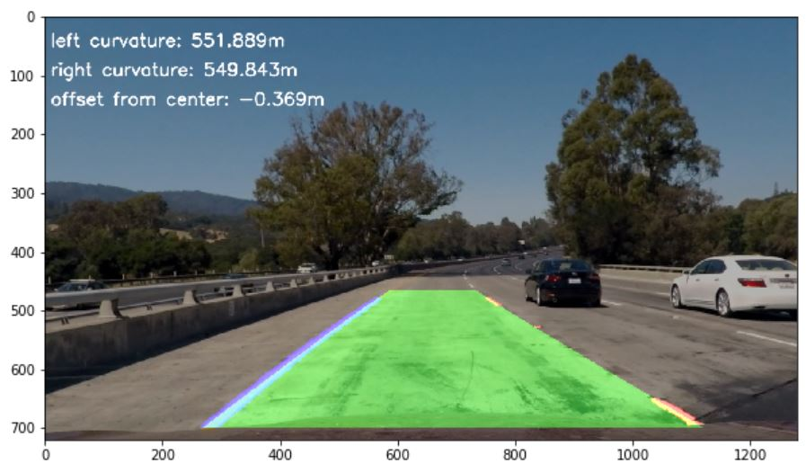

## Advanced Lane Finding

In this project, the goal is to write a software pipeline to identify the lane boundaries in a video.  Check out the [writeup](./writeup.md) for this project to see how it's done. 

The Project
---

The goals / steps of this project are the following:

* Compute the camera calibration matrix and distortion coefficients given a set of chessboard images.
* Apply a distortion correction to raw images.
* Use color transforms, gradients, etc., to create a thresholded binary image.
* Apply a perspective transform to rectify binary image ("birds-eye view").
* Detect lane pixels and fit to find the lane boundary.
* Determine the curvature of the lane and vehicle position with respect to center.
* Warp the detected lane boundaries back onto the original image.
* Output visual display of the lane boundaries and numerical estimation of lane curvature and vehicle position.

The images for camera calibration are stored in the folder called `camera_cal`.  The images in `test_images` are for testing your pipeline on single frames.  If you want to extract more test images from the videos, you can simply use an image writing method like `cv2.imwrite()`, i.e., you can read the video in frame by frame as usual, and for frames you want to save for later you can write to an image file.  

Examples of the output from each stage of my pipeline are in the folder called [output_images](./output_images) and a description of each image is provided in the [writeup](./writeup.md). The video called [project_video.mp4](./project_video.mp4) is the video the pipeline should work well on.  

The [challenge_video.mp4](./challenge_video.mp4) video is an extra (and optional) challenge to test the pipeline under somewhat trickier conditions.  The [harder_challenge.mp4](./harder_challenge.mp4) video is another optional challenge and is brutal! Currently these both are too tricky for the pipeline. Changes that might help are included in the [writeup](./writeup.md).

